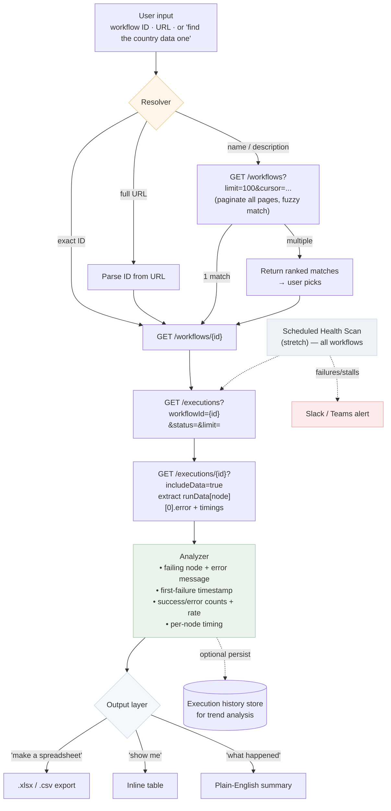

# ARCHITECTURE — n8n Execution Analyst

## Key Design Decisions
- **Read-only in v1** — analysis never edits/deploys workflows. Keeps it safe to run against production.
- **Resolver is the entry point** — supports the "paste anything or just describe it" UX. URL parsing + fuzzy name search over cursor-paginated workflow list.
- **Per-node error extraction** — the value is in `data.resultData.runData.[nodeName][0].error`, exactly where the Onspring 1119 error was found.
- **Output is user-driven** — same analysis, rendered as spreadsheet / table / prose on demand.
- **Health scan is the prevention layer** — turns reactive diagnosis into proactive detection; directly addresses the silent-failure root cause from the Onspring incident.
