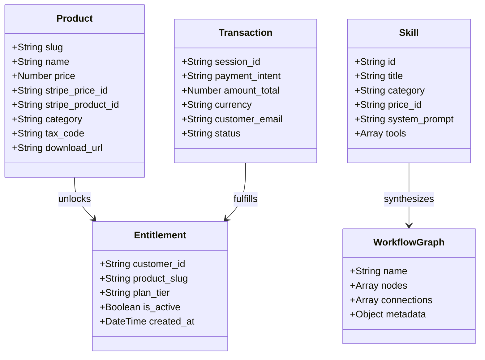

# 04. SalesGency Information Architecture (IA) Standard

## 1. Canonical Domain Objects

---

## 2. Navigation Grammar & URL Taxonomy

### 2.1 Public Marketing Cluster
- `/` — **Homepage & Value Promise** (Hero, Interactive Agent Demo, 5-Pillar Architecture, Social Proof, Commercial Overview).
- `/services.html` — **Services & Pricing Sprints** (Interactive GSAP sticky cards for Inbound, Outbound, Deal Intelligence, and Sprints).
- `/pricing.html` — **Commercial Matrix & Catalog** (Complete breakdown of all 15 offerings, comparisons, and FAQ).
- `/process.html` — **Revenue Engineering Methodology** (Detailed 4-phase deployment lifecycle: Discovery, Synthesis, Wiring, Optimization).
- `/about.html` — **Company & Operator Philosophy** (Diamitani Industries overview, sovereign code manifesto).

### 2.2 Application & Studio Cluster
- `/app.html` — **Interactive Studio & Workbench** (Dynamic prompt input, mode switcher, live terminal sandbox, JSON exporter).
- `/marketplace/*.html` — **Modular Template Storefronts** (Pre-built n8n graphs, prompt packs, and skill plugins).

### 2.3 Fulfillment & Commerce Cluster
- `/checkout-success.html` — **Fulfillment & Asset Unlock** (Secure token/session verification, instant asset download).
- `/api/stripe/create-checkout-session` — **Session Gateway** (Creates Stripe-hosted session with tax code and metadata).
- `/api/stripe/portal` — **Customer Billing Portal** (Self-service invoice history, payment method updates, plan changes).

### 2.4 Legal & Compliance Cluster
- `/terms.html` — **Terms of Service & Code Licensing** (100% Client Code Ownership guarantee).
- `/privacy.html` — **Privacy Policy & Data Protection** (Zero tracking of confidential customer leads).

---

## 3. Role-Based Access Control (RBAC) Matrix

| Role | Browse Public Catalog | Generate Free Prompts | Access Free Downloads | Purchase Products | Manage Subscription Portal |
|---|:---:|:---:|:---:|:---:|:---:|
| **Anonymous Visitor** | ✅ | ✅ | ✅ | ✅ | ❌ |
| **Purchased Client** | ✅ | ✅ | ✅ | ✅ | ✅ (Via Stripe Session) |
| **Subscriber (GTM / Retainer)** | ✅ | ✅ | ✅ | ✅ | ✅ (Full Portal Access) |
| **System Operator** | ✅ | ✅ | ✅ | ✅ | ✅ (Root Access) |
