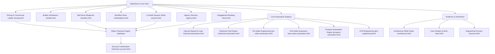

# SalesGency® Canonical Sitemap & URL Architecture

## 1. Information Architecture Overview & Topology

---

## 2. URL Cluster Catalog

### 2.1 Core Commercial & Discovery Cluster (Public, Indexed)

| Path | Purpose | Auth Gate | SEO Intent | Priority | Index |
|---|---|---|---|:---:|:---:|
| `/` (`index.html`) | Primary SalesGency flagship landing & value proposition | Public | Brand / High-converting home | 1.0 | Yes |
| `/pricing.html` | Unified 15-tier commercial ladder ($999 to $19,999/mo) | Public | Intent / Commercial evaluation | 1.0 | Yes |
| `/builder.html` | Autonomous prompt-to-app sales infrastructure workbench | Public | Product / Interactive tool | 1.0 | Yes |
| `/bundles.html` | Self-serve blueprint bundles & $199 modular skill plugins | Public | Commercial / Self-serve store | 0.95 | Yes |
| `/marketplace.html` | Workflow marketplace & downloadable n8n execution graphs | Public | Catalog / E-commerce store | 0.95 | Yes |
| `/build-session.html` | 1-Hour live co-build architecture session ($999) | Public | Low-friction high-intent pilot | 0.95 | Yes |
| `/agency.html` | Turnkey 14-day and 30-day GTM engineering sprints | Public | Agency / High-ticket services | 0.95 | Yes |
| `/book.html` | Qualification and calendar booking consultation | Public | Lead capture / Consultation | 0.90 | Yes |

### 2.2 Core Automation Solutions (Public, Indexed)

| Path | Purpose | Auth Gate | SEO Intent | Priority | Index |
|---|---|---|---|:---:|:---:|
| `/inbound-automation.html` | Sub-30-second inbound speed-to-lead webhook listener | Public | Solution / Inbound RevOps | 0.90 | Yes |
| `/outbound-automation.html` | Cold email deliverability & waterfall enrichment pipeline | Public | Solution / Outbound pipeline | 0.90 | Yes |
| `/pre-sales-automation.html` | Automated research dossiers and RFP battlecards | Public | Solution / Pre-sales intelligence | 0.90 | Yes |
| `/post-sales-automation.html` | Automated onboarding triggers and CS expansion alerts | Public | Solution / Customer retention | 0.90 | Yes |
| `/prospect-automation.html` | Prospect Automation Engine (PAE) 5-pillar architecture | Public | Solution / Prospect automation | 0.90 | Yes |
| `/gtm-engineering.html` | Comprehensive GTM engineering practice & systems | Public | Authority / GTM Engineering | 0.90 | Yes |
| `/gtm-agent.html` | Autonomous GTM agent operational profile | Public | Product / Autonomous agents | 0.90 | Yes |
| `/n8n-analyst.html` | n8n execution graph debugger and performance analyst | Public | Tool / n8n workflow monitoring | 0.85 | Yes |
| `/uysg-growth-suite.html` | Unleash Your Sales Greatness growth enablement suite | Public | Solution / Sales enablement | 0.85 | Yes |
| `/daily-execution-report.html` | Automated executive execution scorecard | Public | Reporting / Operations | 0.90 | Yes |
| `/daily-gtm-report.html` | Executive revenue intelligence dashboard | Public | Reporting / RevOps | 0.90 | Yes |

### 2.3 Evidence, Trust & Architecture (Public, Indexed)

| Path | Purpose | Auth Gate | SEO Intent | Priority | Index |
|---|---|---|---|:---:|:---:|
| `/architecture.html` | Comprehensive system architecture & data security spec | Public | Trust / Enterprise technical buyers | 0.85 | Yes |
| `/work.html` | Client case studies and audited revenue outcomes | Public | Social proof / Enterprise credibility | 0.85 | Yes |
| `/case-studies.html` | Detailed case study directory | Public | Social proof / ROI validation | 0.85 | Yes |
| `/process.html` | 30-Day sprint methodology and engineering deliverables | Public | Process transparency | 0.80 | Yes |
| `/about.html` | Diamitani Industries mission, principles, and team | Public | Brand trust / About | 0.75 | Yes |
| `/qualification.html` | GTM Architecture Audit self-qualification questionnaire | Public | Lead scoring | 0.85 | Yes |
| `/deployment.html` | Deployment specifications and handoff protocols | Public | Technical documentation | 0.80 | Yes |
| `/services.html` | Overview of all specialized engineering services | Public | Service taxonomy | 0.85 | Yes |

### 2.4 Modular Catalogs (Skills, Agents, Workflows, Templates)

| Path | Purpose | Auth Gate | SEO Intent | Priority | Index |
|---|---|---|---|:---:|:---:|
| `/templates.html` | Full template inventory and configuration parameters | Public | Catalog / Resource library | 0.90 | Yes |
| `/skills.html` | Agent skill repository and behavioral capabilities | Public | Technical catalog | 0.85 | Yes |
| `/workflows.html` | Deterministic n8n revenue workflow directory | Public | Technical catalog | 0.85 | Yes |
| `/agents.html` | Autonomous agent runtime catalog | Public | Technical catalog | 0.85 | Yes |

### 2.5 Dedicated Product & Blueprint Detail Pages

| Path | Associated Live Stripe Product | Price | Priority | Index |
|---|---|:---:|:---:|:---:|
| `/product-master-bundle.html` | `blueprint-bundle-growth` | $1,500.00 / $4,999.00 | 0.90 | Yes |
| `/product-inbound-responder.html` | `skill-plugin-inbound` | $199.00 | 0.85 | Yes |
| `/product-apollo-scraper.html` | Apollo Scraping & Enrichment Workflow | $199.00 | 0.85 | Yes |
| `/product-cold-outreach.html` | Automated Cold Outreach Engine | $199.00 | 0.85 | Yes |
| `/product-crm-hygiene.html` | `skill-plugin-crm` | $199.00 | 0.85 | Yes |
| `/product-deliverability-dns.html` | `skill-plugin-dns` | $199.00 | 0.85 | Yes |
| `/product-firmographic-enricher.html` | `skill-plugin-enrich` | $199.00 | 0.85 | Yes |
| `/product-skill-gtm-architect.html` | `skill-plugin-gtm-arch` | $199.00 | 0.80 | Yes |
| `/product-skill-pas-copywriter.html` | `skill-plugin-pas` | $199.00 | 0.80 | Yes |
| `/product-hiring-scraper.html` | Hiring Signal Scraper Workflow | $199.00 | 0.85 | Yes |
| `/product-revops-dashboard.html` | RevOps Unified Dashboard Workflow | $199.00 | 0.85 | Yes |
| `/product-builder-starter.html` | Builder Starter Subscription | $49.00/mo | 0.80 | Yes |
| `/product-builder-pro.html` | Builder Pro Subscription | $149.00/mo | 0.80 | Yes |
| `/product-builder-enterprise.html` | Builder Enterprise Subscription | Custom | 0.80 | Yes |

### 2.6 Legal & Compliance Cluster

| Path | Purpose | Auth Gate | SEO Intent | Index |
|---|---|---|---|:---:|
| `/privacy.html` | Privacy policy & GDPR/CCPA data compliance | Public | Legal transparency | Yes |
| `/terms.html` | Terms of service, licensing, and 100% code ownership | Public | Legal compliance | Yes |

### 2.7 Technical & Commerce Internal Cluster (Never Indexed)

| Path | Purpose | Header / Meta | Robots.txt |
|---|---|---|:---:|
| `/checkout-success.html` | Post-payment session fulfillment & asset unlock | `noindex, nofollow` | Disallowed |
| `/api/stripe/*` | Serverless payment sessions & webhooks | JSON response | Disallowed |
| `/assets/*.psd` | Raw binary design assets | Raw file | Disallowed |
| `/scratch/*` | Internal scratch & test artifacts | N/A | Disallowed |
