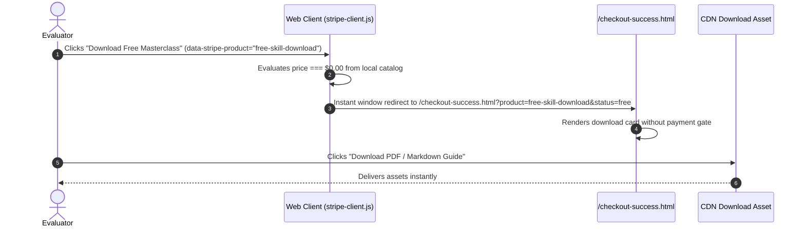
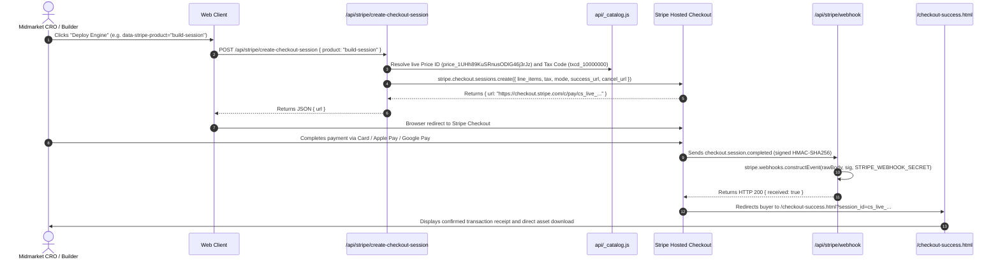
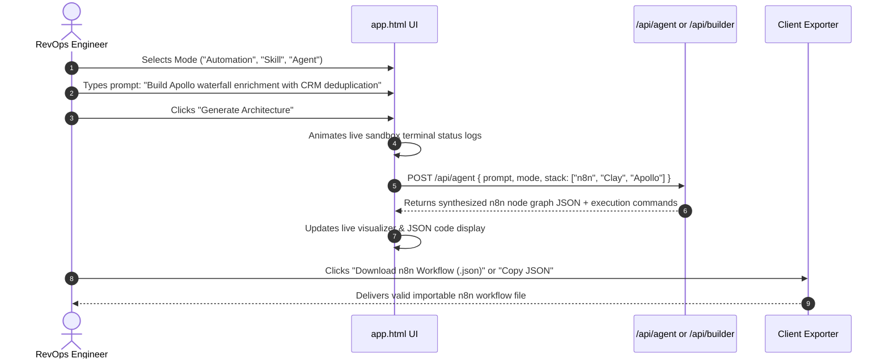
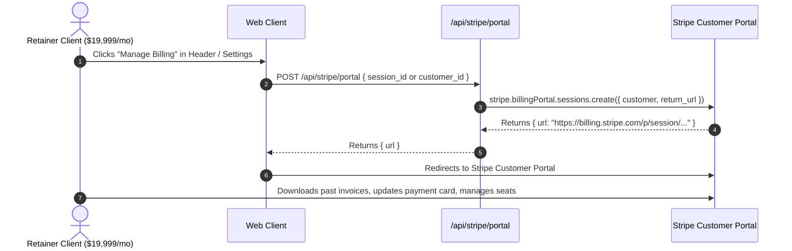

# 06. SalesGency Canonical User Flows

## 1. Flow Overview
This document specifies the step-by-step user journeys and system interactions for all primary commercial, technical, and fulfillment operations.

---

## 2. Flow 1: Zero-Friction Free Asset Fulfillment

---

## 3. Flow 2: Paid Commercial Checkout & Webhook Ingestion

---

## 4. Flow 3: Interactive Prompt-to-Workflow Studio (`app.html`)

---

## 5. Flow 4: Self-Service Customer Billing Portal

