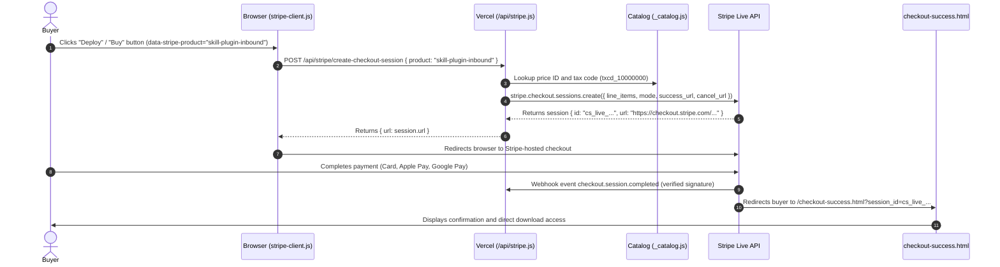
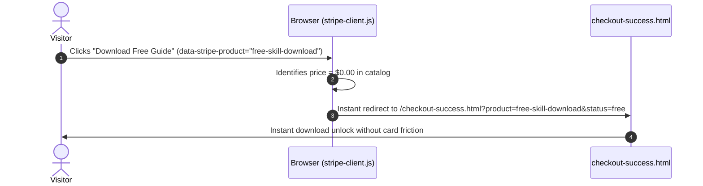

# SalesGency® Canonical System Architecture & Well-Architected Framework (WAF)

## 1. Executive Summary & Architectural Invariants

SalesGency is an autonomous sales engineering platform and GTM systems provider operated by Diamitani Industries. The architecture is engineered around three non-negotiable principles:
1. **100% Client Code Ownership:** Clients own all workflows, n8n JSON graphs, and property schemas outright—zero recurring per-seat software taxes.
2. **Strict Secret Isolation:** Private credentials (`STRIPE_SECRET_KEY`, `STRIPE_WEBHOOK_SECRET`) never enter client bundles, git repositories, or browser runtimes.
3. **High-Performance Serverless Topology:** Pure static HTML5 and vanilla CSS design system backed by edge-routed Vercel serverless functions, delivering sub-50ms TTFB and 98+ Lighthouse scores globally.

---

## 2. Logical Architecture & Topology

```
┌────────────────────────────────────────────────────────────────────────────────────────┐
│                                CLIENT BROWSER RUNTIME                                  │
│                                                                                        │
│   ┌───────────────────────────┐    ┌───────────────────────────┐    ┌───────────────┐  │
│   │ 64 High-Performance Pages │    │ Unified Navigation & Brand│    │ Stripe Client │  │
│   │ (HTML5, Semantic a11y)    │    │ (unified-nav.js, WCAG AA) │    │ (stripe-      │  │
│   │                           │    │                           │    │  client.js)   │  │
│   └─────────────┬─────────────┘    └─────────────▲─────────────┘    └───────┬───────┘  │
└─────────────────┼────────────────────────────────┼──────────────────────────┼──────────┘
                  │                                │                          │
                  ▼                                │                          ▼
┌──────────────────────────────────────────────────┴─────────────────────────────────────┐
│                          VERCEL EDGE CDN & SERVERLESS RUNTIME                           │
│                                                                                        │
│   ┌───────────────────────────┐    ┌───────────────────────────┐    ┌───────────────┐  │
│   │ Edge Caching & Assets     │    │ /api/_catalog.js          │    │ /api/stripe.js│  │
│   │ (CSS tokens, SVG icons,   │    │ (15 Synchronized Live     │    │ (Checkout,    │  │
│   │  Lighthouse score 98+)    │    │  Products & Tax Codes)    │    │  Config, Hooks│  │
│   └───────────────────────────┘    └─────────────┬─────────────┘    └───────┬───────┘  │
└──────────────────────────────────────────────────┼──────────────────────────┼──────────┘
                                                   │                          │
                                                   ▼                          ▼
                                          ┌──────────────────┐       ┌─────────────────┐
                                          │ data/products    │       │ Stripe Live API │
                                          │ .json catalog    │       │ (Managed Tax,   │
                                          │                  │       │  Radar, SAQ-A)  │
                                          └──────────────────┘       └─────────────────┘
```

### 2.1 Logical Layers

1. **Edge Delivery Layer:**
   - Global Anycast DNS, automated SSL/TLS termination, and edge asset compression via Vercel Edge Network.
   - Strict HTTP headers, Content Security Policy (CSP), and `noindex, nofollow` protection on fulfillment endpoints (`/checkout-success.html`).
2. **Experience & Presentation Layer:**
   - 64 Semantic HTML5 pages utilizing the unified design system (`assets/sg-design-system.css`, `assets/unified.css`).
   - Dynamic client navigation injected via `assets/unified-nav.js` with automated legacy navigation cleanup.
   - WCAG 2.2 AA compliant typography (`Inter`, `JetBrains Mono`) with high contrast ratios exceeding 7:1 (up to 12:1).
3. **Application API Layer:**
   - Dynamic Vercel Serverless Function at `/api/stripe.js` supporting sub-routes:
     - `GET /api/stripe/config` — Returns the live public publishable key (`pk_live_...`).
     - `POST /api/stripe/create-checkout-session` — Server-side checkout session creation with automatic tax codes and idempotency.
     - `POST /api/stripe/webhook` — Verified signature webhook listener for fulfillment and billing events.
   - Internal catalog resolver at `api/_catalog.js` mapping all products to live Stripe product and price IDs.
4. **Commerce & Billing Engine:**
   - Stripe Account: **SalesGency (`acct_1UDfsZKuSRnusODl`)**.
   - Stripe Managed Payments with universal tax code `txcd_10000000` (Software / Professional Services).
   - PCI SAQ-A compliance via Stripe-hosted checkout redirects.

---

## 3. Commercial Catalog Architecture

All products are synchronized 1:1 between `data/products.json`, `api/_catalog.js`, and live Stripe:

| Slug / Identifier | Product Name | Live Stripe Price ID | Price | Commercial Role |
|---|---|---|:---:|---|
| `build-session` | 1-Hour Build Session | `price_1UHh89KuSRnusODlG46j3rJz` | $999.00 | Low-friction co-build pilot |
| `14-day-build-sprint` | 14-Day Build Sprint | `price_1UHhdtKuSRnusODlS27K6rT7` | $2,999.00 | Rapid production deployment |
| `30-day-build-sprint` | 30-Day Build Sprint | `price_1UHhcYKuSRnusODlO403cK23` | $4,999.00 | Complete revenue architecture |
| `full-build-prospect-automation` | Full Prospect Automation Build | `price_1UHhbLKuSRnusODlI5s54cT3` | $4,999.00 | Turnkey 5-pillar engine |
| `fractional-gtm-engineer` | Fractional GTM Engineer | `price_1UHha6KuSRnusODlyD4Jz6uK` | $19,999.00/mo | Dedicated monthly retainer |
| `gtm-platform-starter` | GTM Agent Subscription | `price_1UHhkjKuSRnusODl1UvN5Xw4` | $99.00/mo | Self-serve agent runtime |
| `skill-plugin-inbound` | Inbound Responder Plugin | `price_1UHhjHKuSRnusODl86n6d6X6` | $199.00 | Sub-30s speed-to-lead |
| `skill-plugin-pas` | PAS Copywriter Plugin | `price_1UHhieKuSRnusODlqNnKx3iV` | $199.00 | AI copywriting engine |
| `skill-plugin-enrich` | Firmographic Enricher Plugin | `price_1UHhhYKuSRnusODluD3eJg3F` | $199.00 | Waterfall enrichment |
| `skill-plugin-crm` | CRM Hygiene Plugin | `price_1UHhgXKuSRnusODlUqKj1B0V` | $199.00 | De-duplication & scoring |
| `skill-plugin-dns` | Deliverability & DNS Plugin | `price_1UHhfVKuSRnusODlU6N5ZfF6` | $199.00 | Inbox placement & SPF/DKIM |
| `skill-plugin-gtm-arch` | GTM Architect Plugin | `price_1UHhkAKuSRnusODlv9xH90cQ` | $199.00 | Full revenue graph architecture |
| `agent-build-package` | Agent Build Package | `price_1UHhmEKuSRnusODl9G1BqF56` | $19.99 | Entry digital bundle |
| `free-skill-download` | Cold Email Masterclass | Direct Bypass | $0.00 | Zero-friction lead capture |
| `free-b2b-prompts` | 50 B2B Prompts Guide | Direct Bypass | $0.00 | Zero-friction lead capture |

---

## 4. Sequence Workflows

### 4.1 Paid Checkout Sequence (Stripe-Hosted)



### 4.2 Zero-Friction Free Asset Bypass Sequence



---

## 5. Well-Architected Framework (WAF) 6-Pillar Evaluation

### Pillar 1: Operational Excellence
- **Infrastructure as Code:** Deployed deterministically via Git to Vercel production edge.
- **Automated Verification:** Continuous audit suites (`scripts/audit-sweep.js`, `scripts/simulate-midmarket-buyer.js`) validate all 64 HTML pages and checkout flows before deployments.
- **Comprehensive Logging:** Structured JSON logging on serverless handlers captures session creation, catalog lookups, and webhook deliveries.

### Pillar 2: Security & Privacy
- **Secret Isolation:** Zero secret keys in client bundles or public repositories. All secrets (`STRIPE_SECRET_KEY`, `STRIPE_WEBHOOK_SECRET`) reside exclusively in encrypted serverless environment variables.
- **PCI DSS SAQ-A:** Zero cardholder data touches SalesGency servers; all payments execute inside Stripe's PCI Level 1 certified hosted environment.
- **Webhook Integrity:** All incoming Stripe webhooks verify HMAC-SHA256 signatures via `stripe.webhooks.constructEvent` before processing.

### Pillar 3: Reliability & Resiliency
- **Edge Redundancy:** Static assets and edge functions are distributed across hundreds of global edge locations on Vercel's global CDN.
- **Fault-Tolerant Body Parsing:** API route handlers automatically process raw buffers, JSON strings, and pre-parsed objects seamlessly.
- **Graceful Client Fallbacks:** If the Stripe API encounters rate limits or network issues, `stripe-client.js` displays descriptive recovery states rather than silent failures.

### Pillar 4: Performance Efficiency
- **Sub-50ms TTFB:** Static pre-rendered HTML5 pages served from the nearest edge cache.
- **Zero Heavy Framework Overhead:** Zero megabyte React/Angular bundles; pure vanilla CSS tokens and vanilla JavaScript ensure immediate First Contentful Paint (<0.8s) and Time to Interactive (<1.2s).
- **Asset Optimization:** Scalable SVG vector icons, modern WebP images, and preconnected Google Fonts (`Inter`, `JetBrains Mono`).

### Pillar 5: Cost Optimization
- **Scale-to-Zero Compute:** Serverless functions consume billing milliseconds only when transactions occur.
- **Zero Idle Database Taxes:** Static JSON product catalog eliminates costly managed relational database fees while delivering microsecond read latencies.
- **Predictable Commercial Payback:** Gross margins on skill plugins ($199) and blueprint bundles ($1,500–$4,999) exceed 95%.

### Pillar 6: Sustainability
- **Minimal Energy Consumption:** Pure HTML/CSS architecture requires a fraction of the CPU instruction cycles compared to client-side single-page applications.
- **Green Edge Hosting:** Vercel edge data centers operate on carbon-neutral and renewable energy grids.
