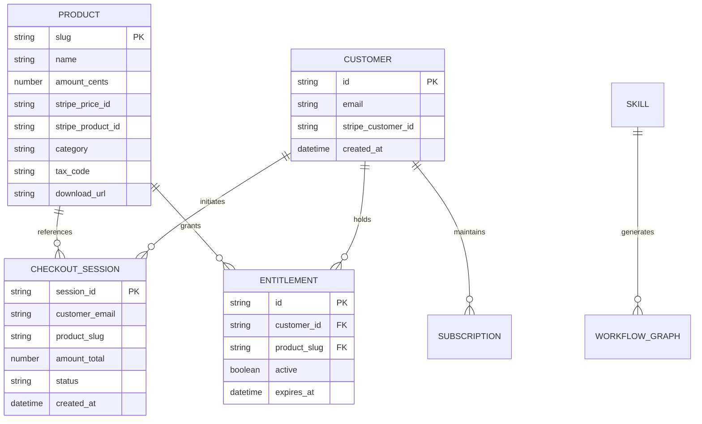

# 12. SalesGency Data Model & Schema Contracts

## 1. Entity-Relationship Overview



---

## 2. JSON Catalog Schema (`data/products.json`)

```json
{
  "$schema": "http://json-schema.org/draft-07/schema#",
  "title": "ProductCatalog",
  "type": "array",
  "items": {
    "type": "object",
    "required": ["slug", "name", "price", "stripe_price_id", "category", "tax_code"],
    "properties": {
      "slug": { "type": "string" },
      "name": { "type": "string" },
      "price": { "type": "number" },
      "stripe_price_id": { "type": "string" },
      "stripe_product_id": { "type": "string" },
      "category": { "type": "string", "enum": ["free", "entry", "skill", "pilot", "sprint", "retainer", "subscription"] },
      "tax_code": { "type": "string", "default": "txcd_10000000" },
      "description": { "type": "string" },
      "download_url": { "type": "string" }
    }
  }
}
```

---

## 3. n8n Workflow Node Schema

```json
{
  "type": "object",
  "required": ["name", "nodes", "connections"],
  "properties": {
    "name": { "type": "string" },
    "nodes": {
      "type": "array",
      "items": {
        "type": "object",
        "required": ["id", "name", "type", "position", "parameters"],
        "properties": {
          "id": { "type": "string" },
          "name": { "type": "string" },
          "type": { "type": "string" },
          "typeVersion": { "type": "number" },
          "position": { "type": "array", "items": { "type": "number" }, "minItems": 2, "maxItems": 2 },
          "parameters": { "type": "object" }
        }
      }
    },
    "connections": { "type": "object" }
  }
}
```
